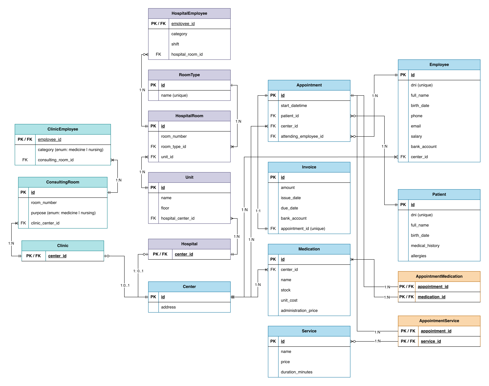

# Healthcare Management Database

Relational database design and SQL implementation for a healthcare management system composed of hospitals and clinics.

This project models the organizational structure, staff, patients, appointments, services, medication inventory, and billing processes of a healthcare network. It was developed as a database design project with a strong focus on relational modeling, data integrity, and clear separation of responsibilities between entities.

## Project overview

The system represents a healthcare network where a **Center** can be either a **Hospital** or a **Clinic**, each with its own internal structure and operational logic.

The database includes:

- healthcare centers (clinics and hospitals)
- hospital units and rooms
- consulting rooms for clinics
- employees and role specialization
- patients and appointments
- medical services
- medication inventory by center
- invoice generation linked to appointments

The project includes both:

- **Entity-Relationship (E/R) modeling**
- **Relational schema design**
- SQL-oriented structure ready for implementation and future extension

## Main design goals

- Model a realistic healthcare domain
- Preserve structural consistency through primary and foreign keys
- Represent specialization using shared primary keys
- Resolve many-to-many relationships explicitly
- Keep the model extensible and maintainable
- Provide a strong foundation for backend-oriented systems

## Core entities

The main entities included in the model are:

- `Center`
- `Hospital`
- `Clinic`
- `Unit`
- `HospitalRoom`
- `RoomType`
- `ConsultingRoom`
- `Employee`
- `HospitalEmployee`
- `ClinicEmployee`
- `Patient`
- `Appointment`
- `Service`
- `Medication`
- `AppointmentService`
- `AppointmentMedication`
- `Invoice`

## Key modeling decisions

### 1. Center specialization

`Center` is modeled as a supertype with two subtypes:

- `Hospital`
- `Clinic`

This allows the system to distinguish structural rules clearly, such as:

- only hospitals can contain units and hospital rooms
- only clinics can contain consulting rooms

### 2. Employee specialization

`Employee` is modeled as a supertype with two subtypes:

- `HospitalEmployee`
- `ClinicEmployee`

This makes it possible to represent shared employee data while also capturing subtype-specific attributes such as:

- hospital shift information
- room assignment
- clinic-specific category

### 3. Many-to-many relationships

The following many-to-many relationships are resolved through junction tables:

- `Appointment` ↔ `Service` via `AppointmentService`
- `Appointment` ↔ `Medication` via `AppointmentMedication`

### 4. Appointment billing

Each appointment generates exactly one invoice, modeled as a **1:1 relationship** between `Appointment` and `Invoice`.

## Diagrams

### Entity-Relationship Diagram


### Relational Schema



## Repository structure

```text
healthcare-management-database/
│
├── README.md
├── LICENSE
│
├── docs/
│   ├── system_overview.md
│   ├── modeling_decisions.md
│   └── data_dictionary.md
│
├── diagrams/
│   ├── er_diagram.png
│   └── relational_schema.png
│
├── sql/
│   ├── 01_schema.sql
│   ├── 02_seed_data.sql
│   └── 03_validation_queries.sql
│
├── queries/
│   ├── operational_queries.sql
│   ├── reporting_queries.sql
│   └── analytics_queries.sql
│
└── docker/
    └── docker-compose.yml
```

## Planned SQL implementation

This repository is designed to evolve from conceptual and logical modeling into a more complete SQL-based project, including:

- table creation scripts
- constraints and referential integrity
- indexes
- seed/sample data
- example business queries
- optional Docker-based local setup

## Example use cases

The database supports scenarios such as:

- registering hospitals and clinics under a shared healthcare network
- assigning employees to a specific center and room
- managing patients and their appointments
- linking services and medications to each appointment
- tracking medication stock by center
- generating invoices associated with medical appointments

## Technical focus

This project is especially relevant for demonstrating skills in:

- relational database design
- entity modeling
- normalization and schema structure
- SQL-oriented thinking
- backend data modeling
- system design fundamentals

## Possible future improvements

Some natural extensions of the project could include:

- appointment status tracking
- payment status for invoices
- audit tables
- prescription records
- medical reports
- role-based access control
- API integration with a backend service
- test dataset generation
